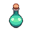

# PixPotion 🎨

A powerful pixel art generator that transforms text prompts into stunning pixel art sprites. Built with React, Express.js, and AI-powered generation capabilities.



## ✨ Features

- **AI-Powered Generation**: Create pixel art from text descriptions
- **Multiple Styles**: Various artistic styles and effects
- **Customizable Dimensions**: Support for different sprite sizes (64x64 to 512x512)
- **Reference Image Support**: Upload reference images to guide generation
- **User Authentication**: Secure login with Supabase
- **Credit System**: Managed generation limits based on user plans
- **Marketplace**: Browse and discover community creations
- **Sound Effects**: Immersive audio feedback
- **Responsive Design**: Works on desktop and mobile devices

## 🚀 Tech Stack

### Frontend
- **React 18** - Modern UI framework
- **Vite** - Fast build tool and development server
- **Styled Components** - CSS-in-JS styling
- **React Router** - Client-side routing
- **Supabase** - Authentication and database
- **Axios** - HTTP client for API requests
- **React Toastify** - Notifications
- **Howler.js** - Audio management

### Backend
- **Express.js** - Web application framework
- **MongoDB** with Mongoose - Database and ODM
- **JWT** - Authentication tokens
- **Multer** - File upload handling
- **bcrypt** - Password hashing
- **CORS** - Cross-origin resource sharing

## 📦 Installation

### Prerequisites
- Node.js (v16 or higher)
- MongoDB database
- Supabase account

### Clone the Repository
```bash
git clone https://github.com/yourusername/pixpotion.git
cd pixpotion
```

### Install Dependencies
```bash
npm run install-all
```

This command will install dependencies for the root, client, and server directories.

### Environment Setup

#### Server Environment Variables
Create a `.env` file in the `server` directory:
```env
MONGODB_URI=your_mongodb_connection_string
JWT_SECRET=your_jwt_secret_key
SUPABASE_URL=your_supabase_url
SUPABASE_ANON_KEY=your_supabase_anon_key
PORT=5000
```

#### Client Environment Variables
Create a `.env` file in the `client` directory:
```env
VITE_SUPABASE_URL=your_supabase_url
VITE_SUPABASE_ANON_KEY=your_supabase_anon_key
VITE_API_BASE_URL=http://localhost:5000
```

## 🏃‍♂️ Running the Application

### Development Mode
Run both client and server concurrently:
```bash
npm run dev
```

### Individual Services
Run only the server:
```bash
npm run server
```

Run only the client:
```bash
npm run client
```

### Production
Build the client:
```bash
cd client && npm run build
```

Start the server:
```bash
npm start
```

## 📁 Project Structure

```
pixpotion/
├── client/                 # React frontend application
│   ├── public/            # Static assets
│   │   ├── fonts/         # Custom fonts
│   │   ├── icons/         # Icon files
│   │   ├── images/        # Image assets
│   │   └── sounds/        # Audio files
│   └── src/
│       ├── components/    # React components
│       │   ├── auth/      # Authentication components
│       │   ├── effects/   # Visual effects
│       │   ├── generator/ # Main generation interface
│       │   ├── marketplace/ # Community marketplace
│       │   └── ui/        # Reusable UI components
│       ├── context/       # React context providers
│       ├── pages/         # Page components
│       ├── styles/        # Global styles
│       └── utils/         # Utility functions
├── server/                # Express.js backend
│   ├── controllers/       # Route controllers
│   ├── middleware/        # Custom middleware
│   ├── models/           # Database models
│   ├── routes/           # API routes
│   └── uploads/          # File upload directory
└── package.json          # Root package configuration
```

## 🎮 Usage

1. **Sign Up/Login**: Create an account or login with existing credentials
2. **Enter Prompt**: Describe the pixel art you want to generate
3. **Configure Settings**: 
   - Choose dimensions (64x64 to 512x512)
   - Select artistic style
   - Adjust generation parameters
   - Upload reference image (optional)
4. **Generate**: Click generate and wait for your pixel art
5. **Download**: Save your creation to your device
6. **Share**: Upload to the marketplace for others to discover

## 🛠️ API Endpoints

### Authentication
- `POST /api/auth/register` - User registration
- `POST /api/auth/login` - User login
- `GET /api/auth/profile` - Get user profile

### Generation
- `POST /api/generate` - Generate pixel art
- `GET /api/generations` - Get user generations
- `DELETE /api/generations/:id` - Delete generation

### Marketplace
- `GET /api/marketplace` - Browse community creations
- `POST /api/marketplace` - Share creation

## 🤝 Contributing

1. Fork the repository
2. Create a feature branch (`git checkout -b feature/amazing-feature`)
3. Commit your changes (`git commit -m 'Add amazing feature'`)
4. Push to the branch (`git push origin feature/amazing-feature`)
5. Open a Pull Request

## 📝 License

This project is licensed under the ISC License - see the [LICENSE](LICENSE) file for details.

## 🙏 Acknowledgments

- AI generation capabilities powered by modern machine learning models
- UI/UX inspired by retro gaming aesthetics
- Community feedback and contributions

## 📞 Support

If you encounter any issues or have questions, please:
1. Check the [Issues](https://github.com/yourusername/pixpotion/issues) page
2. Create a new issue with detailed information
3. Contact the development team

---

Made with ❤️ and lots of pixels
